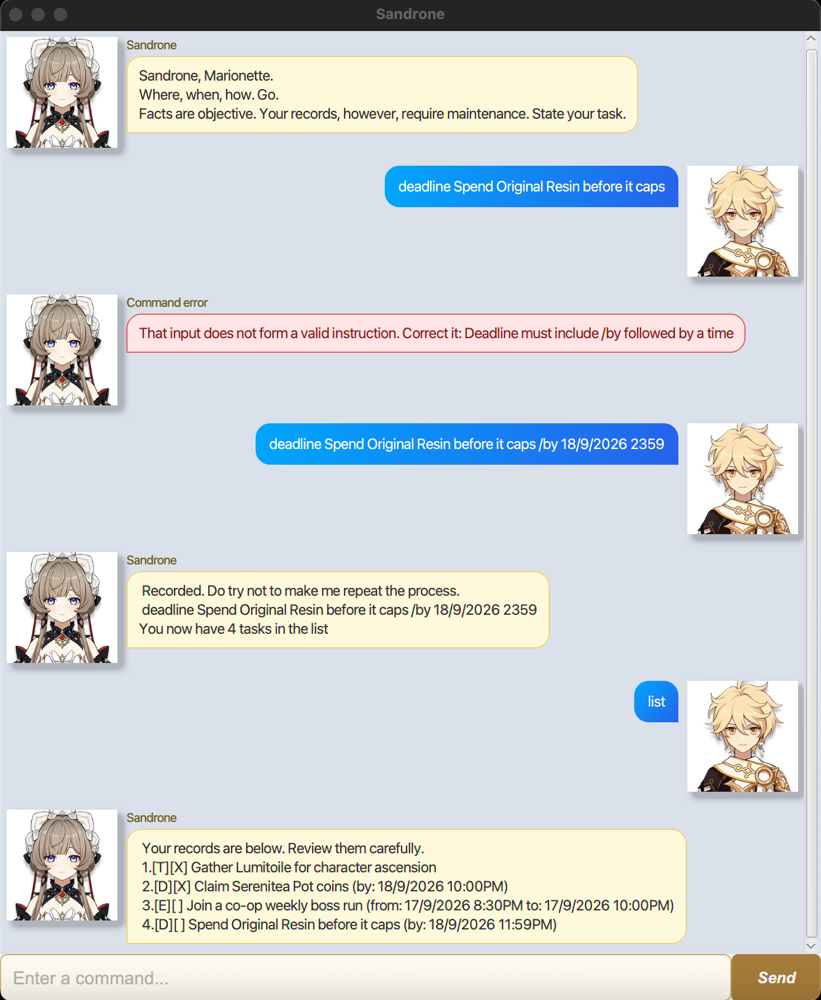

# Sandrone User Guide

Sandrone is a desktop task manager with a precise, records-focused personality. Use it to keep track of todos, deadlines, and events from one command box.



## Quick start

1. Run Sandrone with `./gradlew run`.
2. Type a command in the input box and press <kbd>Enter</kbd> or select **Send**.
3. Sandrone saves task changes automatically in `data/tasks.txt`.

Try this first:

```text
todo Complete daily commissions in Nod-Krai
```

## Command format

- Words in `UPPER_CASE` are values you provide. For example, replace `DESCRIPTION` in `todo DESCRIPTION` with your task.
- Task numbers are one-based: use `1` for the first task shown by `list`.
- Sandrone ignores extra spaces around `/by`, `/from`, and `/to`.
- Dates and times for deadlines and events accept these formats:
  - `2026-09-18 2359`
  - `18/9/2026 2359`
  - `18/9/2026 11:59PM`

## Features

### Add a todo: `todo`

Adds an unscheduled task to your records.

**Format:** `todo DESCRIPTION`

**Example:**

```text
todo Gather Lumitoile for character ascension
```

### Add a deadline: `deadline`

Adds a task that must be completed by a specified date and time.

**Format:** `deadline DESCRIPTION /by DATE TIME`

**Example:**

```text
deadline Spend Original Resin before it caps /by 18/9/2026 2359
```

### Add an event: `event`

Adds an event with a start and end date and time. The end must be later than the start.

**Format:** `event DESCRIPTION /from START_DATE TIME /to END_DATE TIME`

**Example:**

```text
event Farm talent books with the party /from 17/9/2026 1900 /to 17/9/2026 2030
```

### List tasks: `list`

Lists every task. Add a date to show only tasks scheduled on that date.

**Format:** `list [DATE]`

**Examples:**

```text
list
list 18/9/2026
```

### Find tasks: `find`

Shows tasks whose descriptions contain the keyword, without regard to letter case.

**Format:** `find KEYWORD`

**Example:**

```text
find resin
```

### Mark a task complete: `mark`

Marks the numbered task as complete.

**Format:** `mark TASK_NUMBER`

**Example:**

```text
mark 1
```

### Mark a task incomplete: `unmark`

Marks the numbered task as incomplete again.

**Format:** `unmark TASK_NUMBER`

**Example:**

```text
unmark 1
```

### Remove a task: `remove`

Removes the numbered task from your records.

**Format:** `remove TASK_NUMBER`

**Example:**

```text
remove 3
```

### View task statistics: `stats`

Shows the total, completed, incomplete, and scheduled-task counts, including a breakdown by task type.

**Format:** `stats`

**Example:**

```text
stats
```

### End the session: `bye`

Displays Sandrone's goodbye message and disables further command input. Close the window when you are finished reading the conversation.

**Format:** `bye`

**Example:**

```text
bye
```

## Handling errors

Sandrone shows command errors in a red response card. Read the message, correct the command, and try again. For example, a deadline needs both `/by` and a date and time:

```text
deadline Spend Original Resin before it caps
```

Use the corrected command instead:

```text
deadline Spend Original Resin before it caps /by 18/9/2026 2359
```
